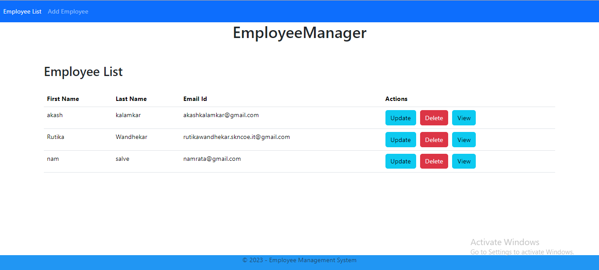

## Employee Management System

This is a simple Employee Management System implemented using Spring Boot for the backend and Angular for the frontend.

## Project Structure

- `SpringBoot/`: Contains the Spring Boot backend code.
- `Angular/`: Contains the Angular frontend code.
- `docs/`: Documentation and other resources.

## Getting Started

### Prerequisites

- Java Development Kit (JDK)
- Node.js and npm
- Angular CLI

### Running the Backend (Spring Boot)

1. Open a terminal and navigate to the `SpringBoot/` directory.
2. Run the following command to start the Spring Boot application:

   ```bash
   ./mvnw spring-boot:run
## Screenshots


## Screenshots


